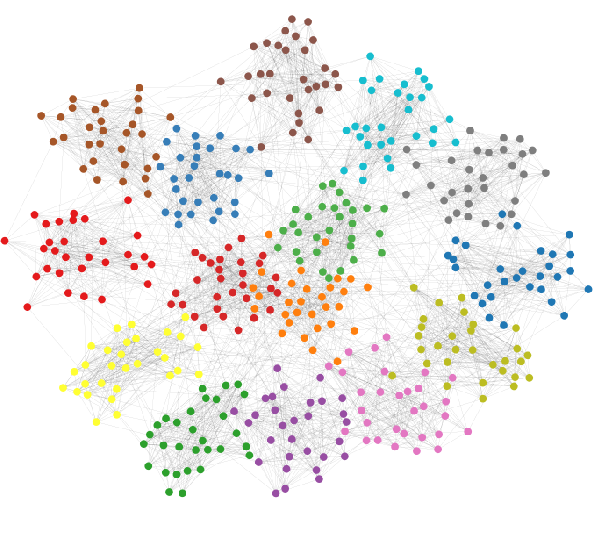

# Graph-neural-networks

Image source : https://arxiv.org/abs/1705.07664

I've been using graph neural networks (GNN) mainly for molecular applications because molecular structures can be represented in graph structures. GNN is interesting in that it can effectively model relationships or interactions between objects in a system. There are various applications of GNN such as molecular applications, network analysis, and physics modeling.

I will introduce GNN in this repository: from theoretical backgrounds to implementations using TensorFlow. I hope you enjoy GNN from this moment.

* References (continually updated) :
